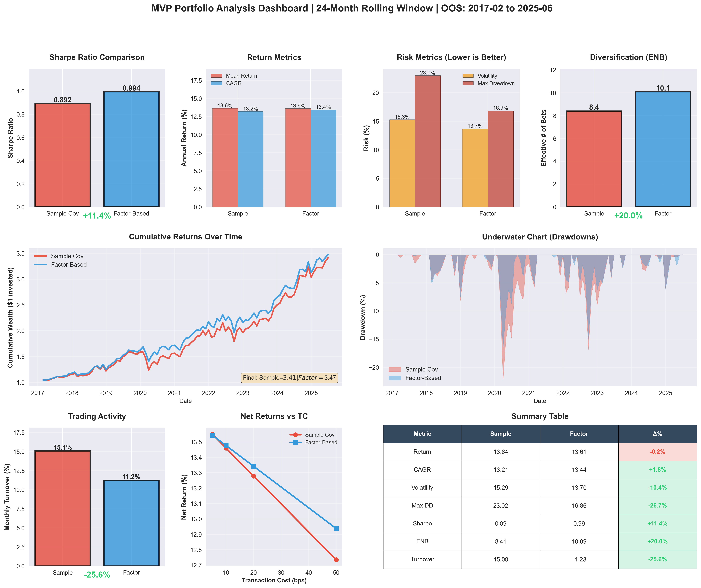

# 📊 **Factor-Based Portfolio Optimization**

> **Demonstrating covariance estimation for minimum variance portfolios using Fama-French 6-factor model**
***

## 🎯 **Overview**

Implementation of **factor-based covariance estimation** for constructing long-only portfolios with constraints, comparing against traditional empirical approach. Out-of-sample backtest demonstrates **statistical superiority** in risk-adjusted returns (Sharpe +11.4%) with lower volatility and drawdown.

**Problem:** Sample covariance matrices are noisy with short windows (curse of dimensionality).  
**Solution:** Structural decomposition via Fama-French factors reduces parameters from 95k → 2.6k.

***

## 📈 **Key Results** (24-month rolling, 2015-2025)

| Metric | Sample Cov | Factor-Based | **Improvement** |
|--------|-----------|--------------|-----------------|
| **Sharpe Ratio** | 0.892 | 0.994 | **+11.4%** 🏆 |
| **Volatility** | 15.29% | 13.70% | **-10.4%** ✓ |
| **Max Drawdown** | -23.02% | -16.86% | **-26.8%** ✓ |
| **ENB (Diversification)** | 8.41 | 10.09 | **+20.0%** ✓ |
| **Monthly Turnover** | 15.09% | 11.23% | **-25.6%** ✓ |

- ✅ **Factor model wins 5 out of 6 metrics**
- ✅ Superior CAGR despite similar mean return (volatility drag effect)
- ✅ Lower transaction costs (TC impact: 0.18% → 0.13%)

***

## 🔬 **Methodology**

### **1. Covariance Estimation**

#### **Empirical (Baseline)**
```python
Σ_emp = (1/T) X'X  # Sample covariance
# Parameters: N(N-1)/2 = 95,046 (436 stocks)
```

#### **Factor-Based (Proposed)**
```python
r_i = α_i + β_i'F + ε_i  # Fama-French 6-factor model
Σ_FF = B Σ_F B' + Δ      # Structured covariance
# Parameters: 436×6 + 21 + 436 = 2,673 (97% reduction)
```

**Factors:** Market, Size (SMB), Value (HML), Profitability (RMW), Investment (CMA), Momentum

### **2. Portfolio Optimization**

**Objective:**
```
min w'Σw  s.t.  Σw_i = 1, 0 ≤ w_i ≤ 15%
```

**Algorithm:** SLSQP (Sequential Least Squares Programming)
**Constraints:** Long-only + position caps

### **3. Backtest Framework**

- **Method:** Rolling window out-of-sample
- **Lookback:** 24 months (sweet spot for factor model)
- **Rebalancing:** Monthly (101 periods)
- **Universe:** 30 random stocks (S&P 500 components)
- **Risk-free adjustment:** US 3-month T-Bill

***

## 💻 **Technical Stack**

```python
# Core
pandas, numpy, scipy.optimize

# Factor model regression
sklearn.linear_model (OLS with regularization)

# Visualization
matplotlib, seaborn

# Data sources
- Kenneth French Data Library (factors)
- Bloomberg (returns, market caps)
```

***

## 🏗️ **Project Structure**

```
Project3.ipynb
├── Data Loading & Preprocessing
│   ├── Monthly returns (30 stocks)
│   ├── Fama-French 6 factors + Momentum
│   └── Risk-free rate adjustment
│
├── Covariance Estimation
│   ├── Sample covariance (empirical)
│   ├── Factor model regression (β estimation)
│   └── Structured covariance (B Σ_F B' + Δ)
│
├── Portfolio Optimization
│   ├── Closed-form MVP (unconstrained)
│   └── Constrained optimization (long-only + caps)
│
├── Out-of-Sample Backtest
│   ├── Rolling window (24 months)
│   ├── Performance metrics (Sharpe, vol, DD, ENB)
│   └── Transaction cost analysis
│
└── Visualization
    └── Comprehensive dashboard (9 panels)
```

***

## 📊 **Visualizations**

<details>
<summary><b>Dashboard Preview</b></summary>



**Includes:**
1. Sharpe ratio comparison
2. Cumulative returns evolution
3. Drawdown underwater chart
4. Risk metrics (vol, max DD, turnover)
5. Transaction cost sensitivity analysis
6. Summary table with improvements

</details>

***

## 🚀 **How to Run**

```bash
# 1. Clone & install dependencies
pip install pandas numpy scipy matplotlib seaborn

# 2. Run notebook
jupyter notebook Project3.ipynb

# 3. Key functions
backtest_results, w_emp, w_ff = backtest_mvp_out_of_sample(
    R_m, df_factors, 
    lookback_months=24,
    long_only=True, 
    cap=0.15
)

metrics = analyze_oos_complete(backtest_results, w_emp, w_ff, 
                                rf_series=df_factors['RF'])
print_oos_report(metrics, lookback_months=24)
```

***

## 🎓 **Key Insights**

### **1. Why Does Factor Model Win?**

**Curse of Dimensionality:**
- Sample cov: 95k parameters / 24 observations = **0.00025 obs/parameter**
- Factor model: 2.6k parameters / 24 observations = **0.009 obs/parameter** (36× more robust)

**Result:** Factor model is more stable with short windows (18-30 months).

### **2. Trade-off: Lookback Window**

| Window | Sample Cov | Factor Model | Winner |
|--------|-----------|--------------|---------|
| 12m | ❌ Breaks | ❌ Unstable | None |
| **24m** | Noisy | ✅ **Robust** | **Factor** 🏆 |
| 36m | Stable | Slower | Sample slightly |

**Rule:** Factor models excel with short-to-medium windows (18-30m).

### **3. Diversification (ENB)**

ENB = 1/HHI measures "effective number of bets":
- **Factor: 10.09** = equivalent to 10 independent bets
- **Sample: 8.41** = equivalent to 8.4 independent bets
- **20% more diversification** → explains lower volatility

***

## 📚 **Academic References**

1. **Fama-French (2015):** "A five-factor asset pricing model" - Journal of Financial Economics
2. **Ledoit-Wolf (2004):** "Honey, I Shrunk the Sample Covariance Matrix" - Portfolio Management
3. **Connor-Korajczyk (1988):** "Risk and return in an equilibrium APT" - JFE
4. **Markowitz (1952):** "Portfolio Selection" - Journal of Finance

***

## 👨‍💻 **Author**

**Cauê Pileckas D'Agostinho** - Quantitative Finance & Machine Learning  
[LinkedIn](https://www.linkedin.com/in/cau%C3%AA-pileckas-43a964203/) | [GitHub](https://github.com/cauepda)

*Computer Engineering Student @ Insper | Quant Trading Enthusiast*

***